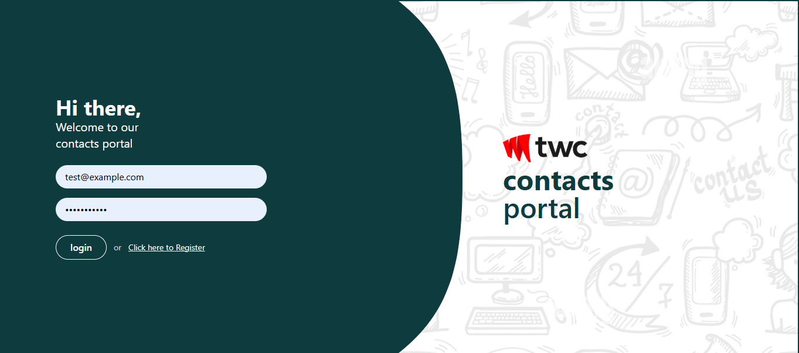
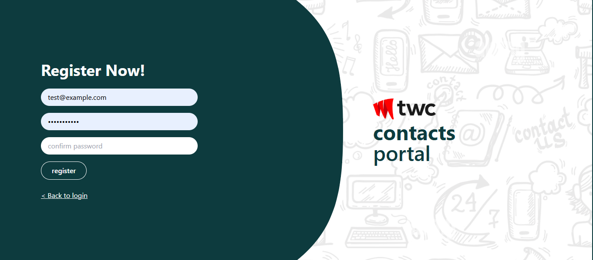
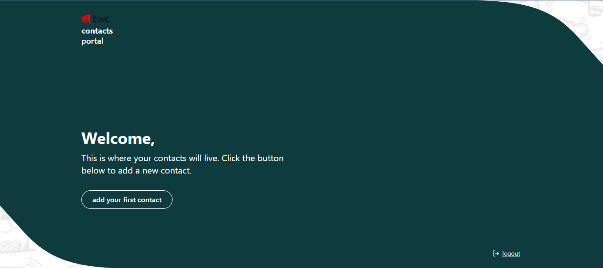
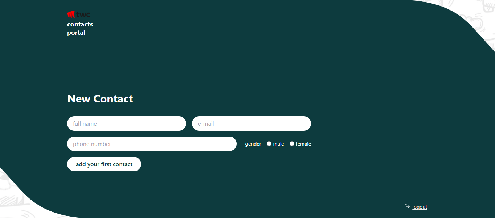
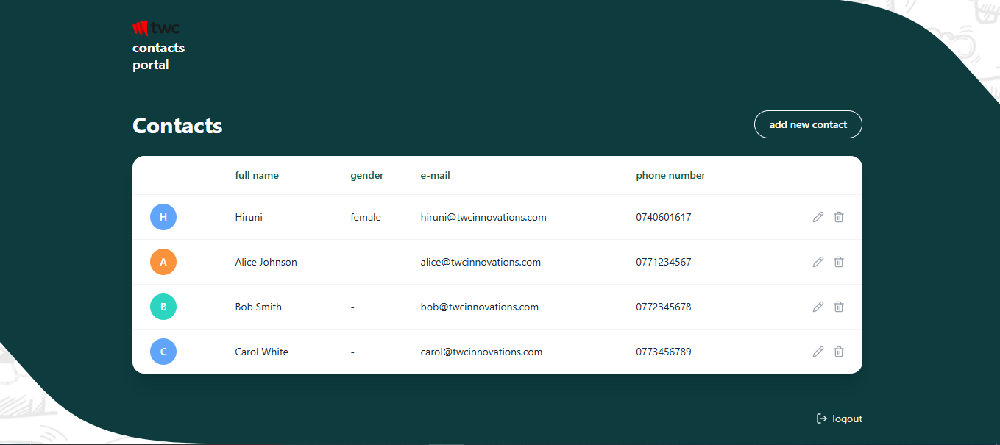
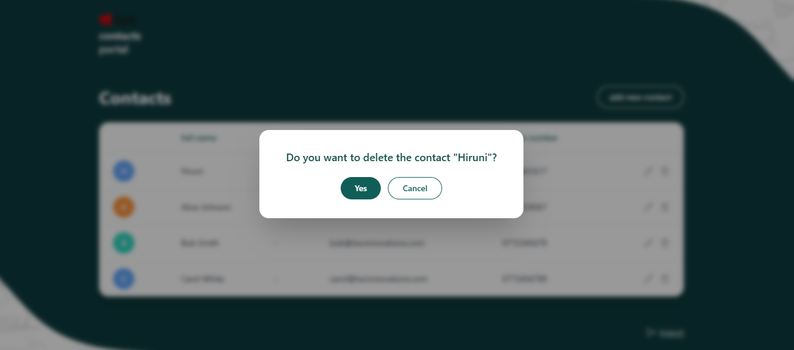

# TWC Contacts Portal

A full-stack contacts management app with authentication, built with React, Nest.js, Prisma, and MySQL.

## Tech Stack

- **Frontend:** React (Vite + TypeScript), TailwindCSS, React Router, TanStack Query, React Hook Form, Zod
- **Backend:** Nest.js, Prisma ORM, JWT (cookie-based) authentication, bcrypt
- **Database:** MySQL
- **Infrastructure:** Docker, Docker Compose

## Project Structure

```
twc-contact-portal/
├── contacts-api/     # Nest.js backend
├── contacts-web/     # React frontend
└── docker-compose.yml
```

## Screenshots


| Login | Register |
|---|---|
|  |  |

| Welcome | New Contact |
|---|---|
|  |  |

| Contacts List | Delete Confirmation |
|---|---|
|  |  |

## Running with Docker (recommended)

This is the simplest way to run the full stack — no local Node/MySQL setup required.

```bash
docker compose up --build
```

This will:
- Spin up a MySQL database
- Build and start the Nest.js API (runs migrations + seeds the database automatically)
- Build and start the React frontend, served via nginx

Once running:
- **Frontend:** http://localhost:5173
- **Backend API:** http://localhost:3000

### Demo credentials

```
Email: admin@twcinnovations.com
Password: admin
```

The database is pre-seeded with this user and 3 sample contacts on first startup.

To stop:
```bash
docker compose down
```

To stop and wipe the database (fresh reseed on next `up`):
```bash
docker compose down -v
```

## Running locally (without Docker)

### Prerequisites
- Node.js 20+
- A running MySQL instance

### 1. Start MySQL (if not using the full Docker Compose setup)

```bash
docker run --name contacts-mysql -e MYSQL_ROOT_PASSWORD=password -e MYSQL_DATABASE=contacts_portal -p 3306:3306 -d mysql:8
```

### 2. Backend setup

```bash
cd contacts-api
npm install
cp .env.development .env   # or edit .env directly
npx prisma migrate dev
npx prisma db seed
npm run start:dev
```

API runs at `http://localhost:3000`.

### 3. Frontend setup

```bash
cd contacts-web
npm install
cp .env.development .env   # or edit .env directly
npm run dev
```

Frontend runs at `http://localhost:5173`.


## API Routes

### Auth
| Method | Route            | Description                        |
|--------|-------------------|-------------------------------------|
| POST   | `/auth/login`     | Log in, sets an httpOnly JWT cookie |
| POST   | `/auth/register`  | Register a new user                 |
| POST   | `/auth/logout`    | Clears the auth cookie              |

### Contacts (all require authentication)
| Method | Route             | Description                          |
|--------|--------------------|----------------------------------------|
| GET    | `/contacts`        | List all contacts for the logged-in user |
| GET    | `/contacts/:id`     | Get a single contact                  |
| POST   | `/contacts`        | Create a new contact                  |
| PUT    | `/contacts/:id`     | Update a contact                      |
| DELETE | `/contacts/:id`     | Delete a contact                      |

## Features

- Login / Register with cookie-based JWT authentication
- Protected routes (redirect to `/login` if unauthenticated)
- Add, view, edit, and delete contacts (scoped per logged-in user)
- Inline editing directly in the contacts table
- Form validation with Zod + React Hook Form
- Data fetching/caching with TanStack Query
- Success and delete-confirmation modals matching the Figma design
- Custom curved UI theme matching the provided design file

## Security Notes

- Passwords are hashed with bcrypt before storage — never stored in plaintext.
- JWTs are stored in `httpOnly` cookies, inaccessible to frontend JavaScript, mitigating XSS token theft.
- All `/contacts` routes are protected by a Nest.js route guard (`JwtAuthGuard`) and scoped per-user, so one user cannot view or modify another user's contacts.
- Generic "Invalid credentials" errors on login prevent leaking whether an email is registered.

## Notes

- Demo data (1 user, 3 contacts) is seeded automatically on first run, both locally and via Docker.